<div align="center">

# VoidStonks

**A Warframe companion for trading and farming that reads your game screen, so it also works
on Linux, on console and on your phone.**

[voidstonks.com](https://voidstonks.com)

</div>

It started as a recruitment message generator and grew into everything you'd want open while
you play: what your stuff is worth, which relic to crack next, whether that riven is any good.
It never touches the game. It only looks at the screen you share with it.

## Scanner

Share your Warframe window once and let it be. It works out which screen you're on and reads
it, no setup needed.

Open your inventory and it goes through it page by page, counts included.

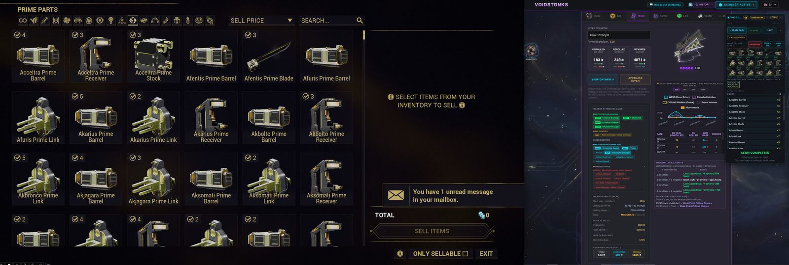

When you pick a relic it remembers which one, and takes it off your inventory once the rewards
come up.

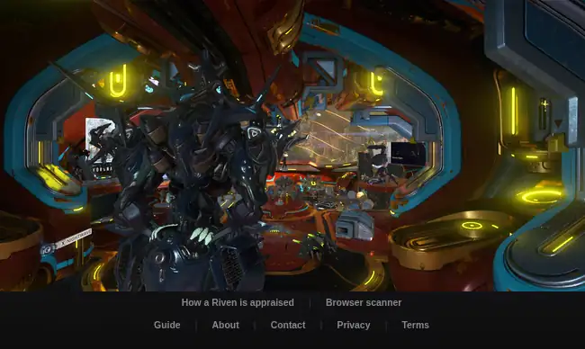

On the reward screen it shows you which part is worth the most, in platinum and in ducats, and
how many of each you already have.

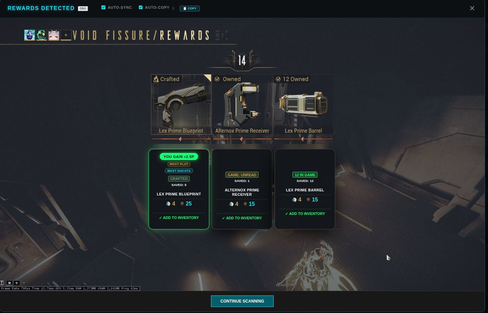

On console you can do the same with your phone: open the site, point the camera at the TV and
take the picture.

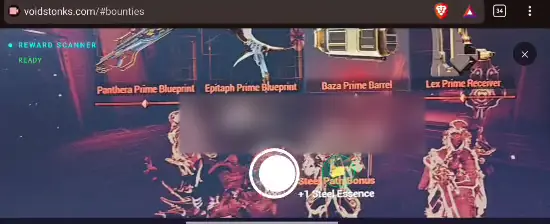

After the mission it reads the summary and adds your loot to the inventory, so there's nothing
to scan again. And when you're rolling a riven, it prices every new roll as it shows up and
puts it next to the one you have.

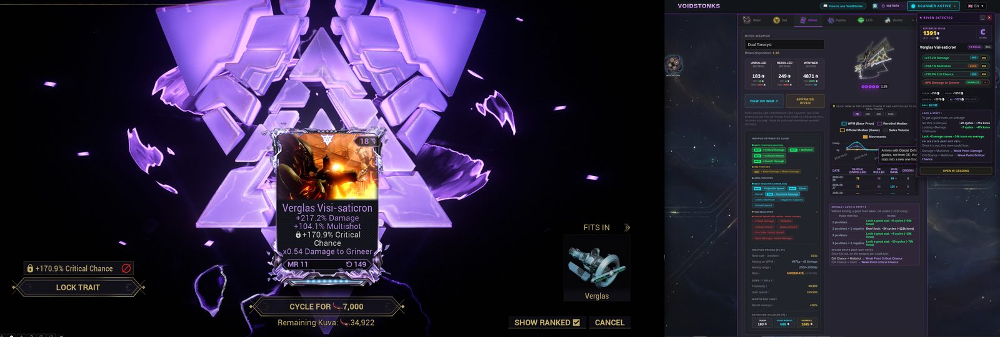
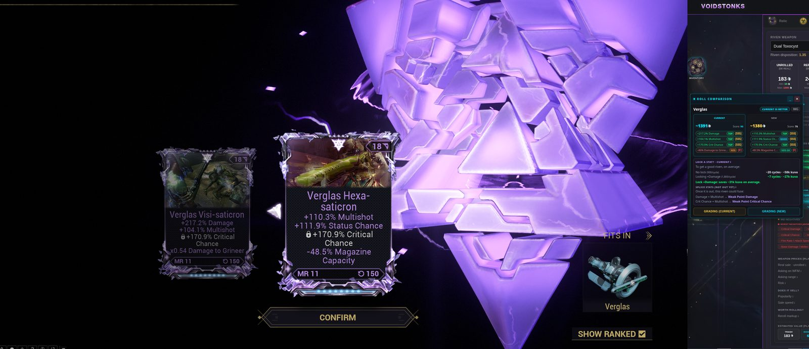

## Inventory

Your prime parts and relics, with a price next to everything. You can see what the whole lot
is worth, which of your sets are climbing or dropping, and for each relic how many runs it
takes to finish a set and what it earns you per run.

<table>
  <tr>
    <td>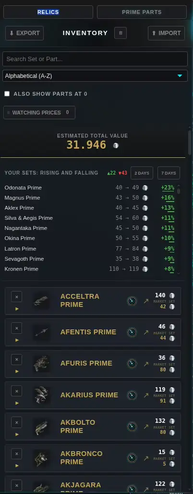</td>
    <td>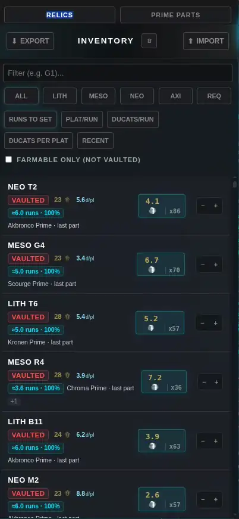</td>
  </tr>
</table>

## Relics and sets

Look up a relic, choose the refinement and how many of you are going, and you'll see what's
inside, what each part goes for and whether you're better off opening it or selling it intact.
Drop a part on the set tracker and it tells you how many runs it usually takes to get it.

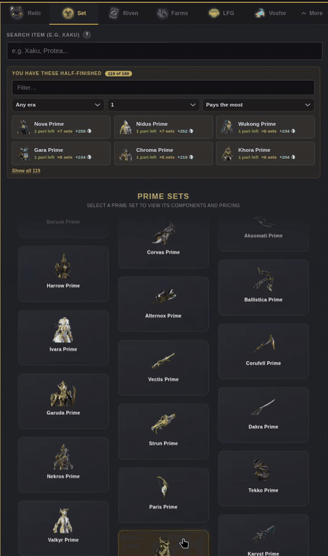

## Rivens

Pick a weapon to see what its rivens go for (unrolled, rolled and listed on warframe.market)
and which stats people want on it. Type in your riven, or let the scanner read it, and you get
a price range and a grade for each stat. It'll even tell you whether locking a stat is worth
the kuva.

<table>
  <tr>
    <td>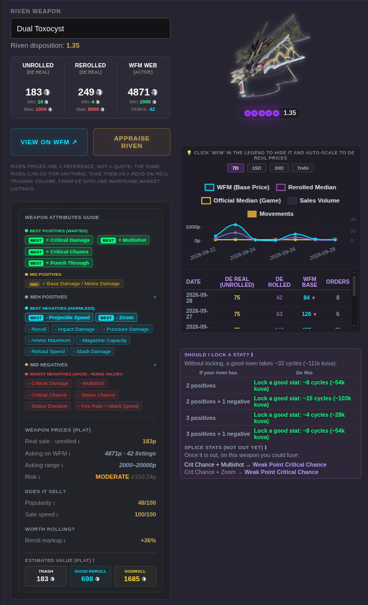</td>
    <td>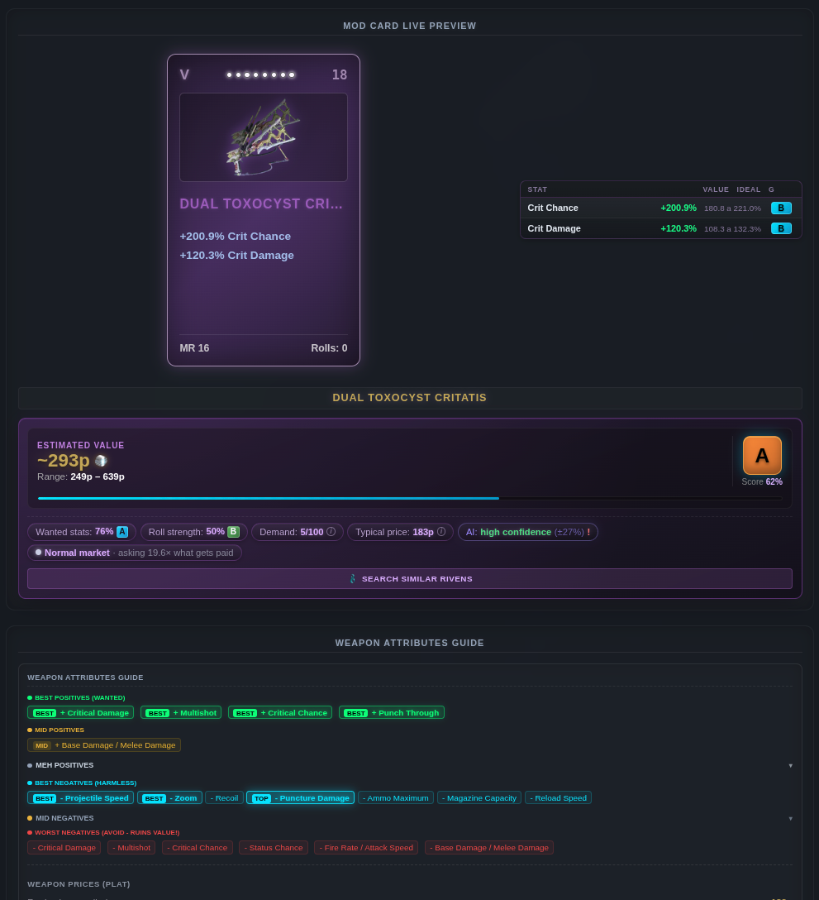</td>
  </tr>
</table>

### How the price is worked out

A stat isn't good in general, it's good on a given weapon. So the first thing it looks at is
what people actually pay for each stat on that weapon, and if the weapon barely sells, it leans
on what those stats are worth across all weapons. Then it checks how close each roll came to
its maximum, and whether the negative hurts something that weapon needs or something it
couldn't care less about. All of that gives the riven a score.

That score is placed among the rivens for that weapon that really sold, somewhere between the
cheap ones and the best ones, and that's your price range. None of this needs machine
learning. The model is a second opinion on top: it was trained on real auctions and runs in
your browser (it downloads the first time you appraise a riven).

Don't read the number too literally. Two almost identical rivens can sell for very different
prices, so the range is what matters, and the typical miss is around half the price. The whole
method, with the numbers behind it, is on the site:
[How a Riven is appraised](https://voidstonks.com/riven-appraisal.html).

## Farms

The fissures open right now, the bounties worth doing, the arbitration schedule and the Coda
and Tenet weapon rotation. Set an alarm for whatever you're chasing and it'll let you know when
it's up.

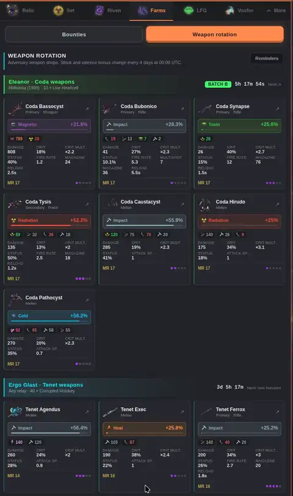

## Vosfor

Sitting on arcanes you don't use? It tells you whether to sell them or dissolve them, which Loid
pack gets you the most platinum for your Vosfor, and how many packs you'd have to open for the
arcane you want.

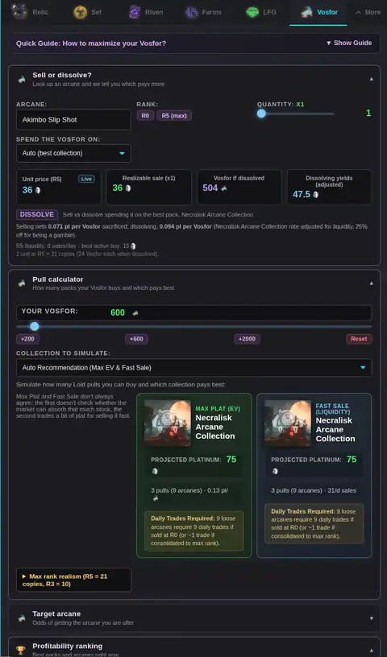

## Ducats

Your prime parts sorted by how many ducats they give against what they'd sell for, so you know
what to bring to Baro and what to put on the market.

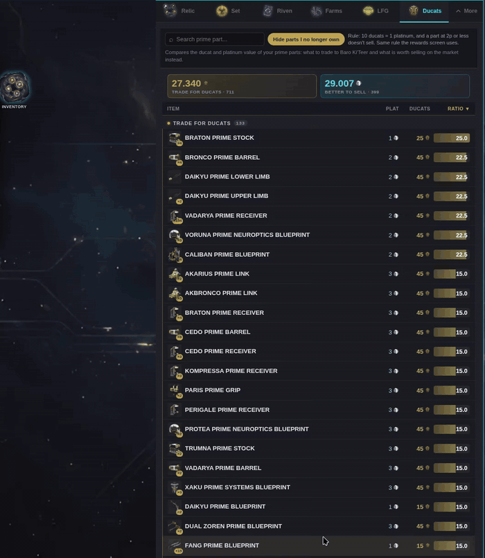

## LFG

Recruitment messages for the runs that need them. Write one on your phone and pick it up on
your PC with a four-digit code.

## Your data

There's no Warframe login, no game files and nothing hooked into the game. Your inventory and
settings stay in your browser, there's no account and nothing is tracked. Prices come from
warframe.market through a cached server, so the app doesn't hammer their API.

## Where it runs

On the web at [voidstonks.com](https://voidstonks.com), on desktop or phone. There's also a
desktop version for Linux and Windows ([desktop/](desktop/README.md)), and an optional browser
extension that lets the scanner copy results to your clipboard while the game has focus
([extension/](extension/README.md)).

## What's in this repository

| Folder | |
|---|---|
| `deploy/` | The app itself. There's no build step, CI only minifies it before publishing. |
| `desktop/` | The desktop build. |
| `extension/` | The clipboard extension. |
| `tests/` | Tests, run on every push. |
| `scripts/`, `scripts-actu/` | The jobs that keep game data, market stats and the riven model fresh. |
| `.github/` | Workflows and the pictures in this README. |

To run it locally:

```bash
npm install
npm run dev:site    # serves deploy/ at http://127.0.0.1:8080
npm test
```

## Feedback

If something breaks, open an issue. If the scanner read something wrong, record it
(DIAG → RECORD, then ZIP) and attach the file: it has the frame and what the scanner saw, which
is what makes it fixable.

<div align="center">
  <i>Fan-made tool, not affiliated with Digital Extremes.</i>
</div>
